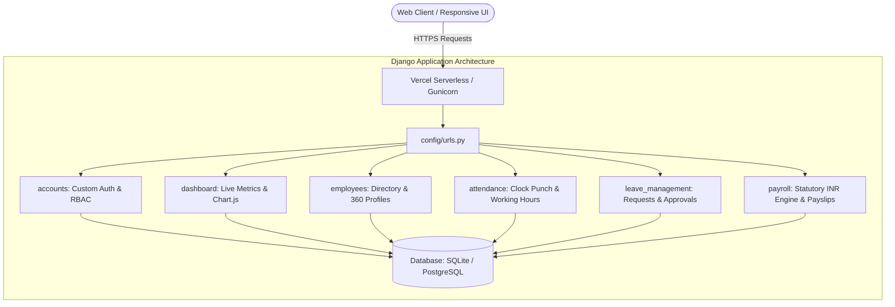

<div align="center">

# 🌐 WorkSphere HRMS
### Enterprise-Grade Human Resource Management & Payroll System

[](https://www.python.org/)
[](https://www.djangoproject.com/)
[](https://getbootstrap.com/)
[](https://worksphere-hrms-lac.vercel.app/accounts/login/)
[](LICENSE)

<br/>

**WorkSphere** is a production-ready, full-stack Human Resource Management System (HRMS) built using **Python, Django, Bootstrap 5, Chart.js, and SQLite / PostgreSQL-ready architecture**. Tailored for modern corporate operations with role-based permissions (RBAC), daily biometric attendance tracking, leave approval workflows, and an Indian statutory payroll engine (₹ INR).

[🚀 Live Demo](https://worksphere-hrms-lac.vercel.app/accounts/login/) • [📖 Features](#-key-modules--features) • [💻 Local Setup](#-local-installation--setup) • [📊 System Architecture](#-system-architecture) • [🎓 Interview Concepts](#-senior-architectural-highlights)

</div>

---

## 🚀 Live Deployment & Demo Credentials

**Live Application URL**: [https://worksphere-hrms-lac.vercel.app/accounts/login/](https://worksphere-hrms-lac.vercel.app/accounts/login/)

> 💡 **Quick Access**: The login page features **1-Click Demo Buttons** to automatically fill credentials for any role.

| Role / Designation | User Account | Username | Password | Key Capabilities |
| :--- | :--- | :--- | :--- | :--- |
| 🛡️ **System Administrator** | **Ashish Mohod** | `admin` | `admin123` | Full dashboard metrics, staff CRUD, role access control (RBAC), Django admin access at `/admin/`. |
| 👔 **HR Manager** | **Pooja Verma** | `hr_pooja` | `hr12345` | Department/Designation setup, approve/reject leave requests with remarks, manual clock entries, auto-generate monthly payroll, export CSV reports. |
| 💻 **Lead Architect (Staff)** | **Rohit Verma** | `rohit_v` | `emp12345` | Personal dashboard, 1-click **Punch In / Punch Out**, submit leave requests, view personal attendance logs, view & print monthly payslips (₹ INR). |
| 🎨 **UI/UX Designer** | **Ananya Deshmukh** | `ananya_d` | `emp12345` | Employee self-service features & personal statements. |

---

## 📊 System Architecture



---

## 🌟 Key Modules & Features

### 1. 🔐 Custom User Authentication & Role-Based Access Control (RBAC)
* **Custom User Model**: Inherits `AbstractUser` with specialized fields (`role`, `phone`, `profile_picture`, `is_verified`).
* **3-Tier Permission Hierarchy**: `ADMIN`, `HR`, and `EMPLOYEE`.
* **Security & Access Control**: Enforced using custom view decorators (`@admin_required`, `@hr_required`) preventing privilege escalation.
* **Profile Management**: Tabbed interface for updating personal profile data and secure password changes.

### 2. 📈 Executive & Employee Dashboards
* **Executive Metrics**: Live count of Total Staff, Present Today, On Leave / Absent, and Pending Leave Requests.
* **Interactive Chart.js Analytics**:
  * **Headcount Distribution**: Bar chart by Department.
  * **Attendance Breakdown**: Real-time donut chart for today\'s attendance status.
* **Recent Activities Feed**: Instant tracking of recent hires, pending approvals, and real-time punch timestamps.
* **Personalized Employee View**: Displays current punch status, leave balance, and latest payslip for logged-in employees.

### 3. 👥 Employee 360° Directory & Department Management
* **Department & Designation Models**: Granular organization mapping with code tracking and active headcount badges.
* **Employee 360° Profile**: Tabbed profile displaying personal info, emergency contacts, clock-in history, leave records, and issued payslips.
* **Atomic Onboarding**: Uses `django.db.transaction.atomic()` to provision both the Django User login and the Employee profile simultaneously.
* **Search & Filters**: Multi-parameter search by Name, Employee ID, Email, and Phone, with filtering by Department and Employment Status.

### 4. ⏱️ Attendance & Working Hours Tracking Engine
* **One-Click Punch In / Punch Out**: Dedicated buttons on navbar and dashboard.
* **Automatic Calculation**: Calculates exact total working hours on checkout and auto-classifies status into `PRESENT` or `HALF_DAY`.
* **Daily Attendance Grid**: Date-filtered table with status filtering and daily operational counters.

### 5. 🌴 Leave Management & Multi-Level Approval Center
* **Leave Categories**: Pre-configured with *Casual Leave (CL)*, *Sick Leave (SL)*, *Privilege Leave (PL)*, *Festival & Optional Holiday (FH)*, and *Emergency Leave (EL)*.
* **Employee Submission**: Form with automatic date duration computation.
* **HR Review Portal**: Review applications with one-click **Approve** or **Reject** with mandatory HR remarks and feedback.

### 6. 💰 Statutory Indian Payroll Engine (₹ INR) & Payslips
* **Compensation Engine**:
  $$\text{Gross Salary} = \text{Basic} + \text{HRA (40\%)} + \text{Medical/Conveyance (₹2,500)} + \text{Special Allowance (15\%)}$$
  $$\text{Statutory Deductions} = \text{Income Tax / TDS (10\%)} + \text{EPF (12\%)} + \text{Professional Tax (₹200)}$$
  $$\text{Net In-Hand Salary} = \text{Gross Salary} - \text{Statutory Deductions}$$
* **Batch Generator**: 1-click **Auto-Generate Month Slips** for all active personnel.
* **Printable Payslip Invoice**: High-definition invoice with corporate branding, PAN, UAN, GSTIN, and direct **Print / Save as PDF** support.
* **Disbursement Tracking**: Mark payment as `PAID` / `UNPAID` with transaction UTR / NEFT reference numbers.

### 7. 📊 Reports & CSV Data Export Hub
* **1-Click Master CSV Exports**:
  1. `Export Employees CSV` (Full profile, department, contact, and salary ledger)
  2. `Export Attendance CSV` (Historical punch times and total hours)
  3. `Export Leaves CSV` (Applications, date ranges, and approval logs)
  4. `Export Payroll CSV` (Monthly salary disbursement sheets)

---

## 📁 Project Directory Structure

```text
WorkSphere/
│
├── config/                  # Core project configuration
│   ├── settings.py          # Decouple configuration, WhiteNoise, static/media, RBAC
│   ├── urls.py              # Central application routing
│   ├── wsgi.py              # WSGI serverless entrypoint for Vercel / Production
│   └── asgi.py              # ASGI configuration
│
├── accounts/                # User authentication & RBAC
│   ├── models.py            # Custom User model extending AbstractUser
│   ├── views.py             # Login, logout, profile & user management
│   ├── forms.py             # Authentication & profile forms
│   ├── decorators.py        # @admin_required, @hr_required access guards
│   └── management/          # Custom seed_data command
│
├── employees/               # Employee directory & organization
│   ├── models.py            # Department, Designation & Employee models
│   ├── views.py             # CRUD views, search & multi-filtering
│   ├── forms.py             # Employee onboarding & department forms
│   └── urls.py
│
├── attendance/              # Time tracking & clock engine
│   ├── models.py            # Daily attendance & working hours model
│   ├── views.py             # Punch in/out, daily logs & manual entry
│   └── forms.py
│
├── leave_management/        # Leave policies & approval workflows
│   ├── models.py            # LeaveType & LeaveRequest models
│   ├── views.py             # Leave applications & HR action portal
│   └── forms.py
│
├── payroll/                 # Statutory Indian compensation & payslips
│   ├── models.py            # Payslip & salary breakdown model
│   ├── views.py             # Monthly batch generator & invoice detail
│   └── forms.py
│
├── dashboard/               # Analytics & master reporting
│   ├── views.py             # Executive stats & CSV export handlers
│   └── urls.py
│
├── templates/               # Global & app-specific Bootstrap 5 templates
├── static/                  # Custom CSS (style.css), JS and UI branding
├── media/                   # User-uploaded profile avatars and documents
├── vercel.json              # Vercel Serverless deployment configuration
├── requirements.txt         # Production dependencies
└── manage.py                # Django CLI entrypoint
```

---

## 💻 Local Installation & Setup

Follow these steps to run **WorkSphere** on your local machine:

### 1. Clone the Repository
```bash
git clone https://github.com/ashishmohod123/WorkSphere.git
cd WorkSphere
```

### 2. Create and Activate Virtual Environment
```bash
# On Windows
python -m venv venv
.\venv\Scripts\activate

# On macOS/Linux
python3 -m venv venv
source venv/bin/activate
```

### 3. Install Dependencies
```bash
pip install -r requirements.txt
```

### 4. Setup Environment Variables
Create a `.env` file in the root directory (or copy `.env.example`):
```ini
SECRET_KEY=your-secure-secret-key-here
DEBUG=True
ALLOWED_HOSTS=127.0.0.1,localhost
```

### 5. Apply Database Migrations
```bash
python manage.py migrate
```

### 6. Seed Realistic Indian Demo Data
```bash
python manage.py seed_data
```

### 7. Run the Development Server
```bash
python manage.py runserver
```
Visit **`http://127.0.0.1:8000/`** in your browser.

---

## 🎓 Senior Architectural Highlights

### 🔹 Preventing N+1 Query Bottlenecks
Single-valued foreign key relationships (`User`, `Department`, `Designation`) are eagerly loaded using `.select_related()` in complex views:
```python
employees = Employee.objects.select_related('user', 'department', 'designation').all()
```
This joins tables in a single SQL query, reducing query count from $O(N)$ to $O(1)$.

### 🔹 Atomic Transactions for Robust Onboarding
Employee creation writes to both `accounts_user` and `employees_employee`. To prevent orphaned accounts, execution is wrapped in `transaction.atomic()`:
```python
with transaction.atomic():
    user = User.objects.create_user(...)
    employee = form.save(commit=False)
    employee.user = user
    employee.save()
```

### 🔹 Decoupled Environment & Twelve-Factor Compliance
Sensitive parameters are managed through `python-decouple`, ensuring zero credential leakage in source repositories.

---

## 👨‍💻 Author

**Ashish Mohod**
* **Project**: WorkSphere HRMS
* **GitHub**: [@ashishmohod123](https://github.com/ashishmohod123)
* **Live Application**: [https://worksphere-hrms-lac.vercel.app](https://worksphere-hrms-lac.vercel.app)

---

## 📄 License
This project is open-source and licensed under the [MIT License](LICENSE).
